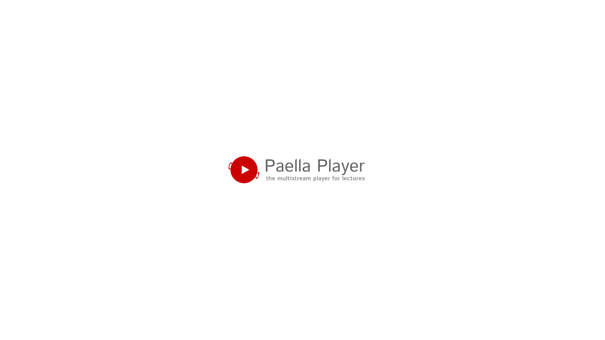

# Initialisation parameters

We discussed the configuration file in the first tutorial, which is where you set the player's settings. But there are certain operating parameters that cannot be specified in the configuration: some of these parameters are required before the configuration is loaded, while others are dynamic parameters that cannot be set in a file. A special parameter object is used for this type of setting, which is passed to the player. This is the initParams object:

**main.js**

```js
import { Paella } from '@asicupv/paella-core';

const initParams = {
    // Initialisation parameters
};
const player = new Paella('playerContainer', initParams);

await player.loadManifest();
```

## Player configuration

It is possible to customise the loading of the configuration file in several ways.

### Customize path

Move the `public/config/config.json` to `public/settings/settings.json`. You can use the `configResourcesUrl` and `configUrl` attributes to customise the name and location of the player configuration. Specifically, `configResourcesUrl` indicates the folder where the files specified in the configuration file are placed, and `configUrl` is the full URL of the configuration file.

Now, add the following init parameters to the .js file:

**main.js**

```js
...
const initParams = {
    configResourcesUrl: 'settings/',
    configUrl: 'settings/settings.json'
};
...
```

## Customize load method

By default, the configuration is loaded via a fetch call which fetches the configuration file from the path generated from `configUrl`. But it is possible to customise this loading method. For example, we can add static configuration settings that overwrite the default configuration file. In the following example we are going to make the `playPauseButton` plugin enabled by default, regardless of what is specified in the configuration:

**main.js**

```js
import { 
    Paella, 
    defaultLoadConfigFunction,
    utils
} from 'paella-core';

const initParams = {
    // Initialization parameters
    configResourcesUrl: 'settings/',
    configUrl: 'settings/settings.json',

    loadConfig: async (configUrl, player) => {
        const config = await defaultLoadConfigFunction(configUrl, player);
        utils.mergeObjects(config, {
            plugins: {
                "es.upv.paella.playPauseButton": {
                    "enabled": true
                }
            }
        })
        return config;
    }
};
const player = new Paella('playerContainer', initParams);
```

- **`defaultLoadConfigFunction`:** is the default implementation of loadConfig.
- **`mergeObjects(objA,objB)`:** combines the `objA` and `objB` objects into `objA`. It will add or replace the attributes defined in `objB` to the `objA` object. It will only replace or add the properties defined in `objB`, so in the example above, the only thing it will modify is to set the enabled property of the playPauseButton plugin to `true`.

To test that it works, remove the play button configuration from the `settings.json` file_

**public/settings/settings.json**

```json
{
    "plugins": [
        ...
        // Note: delete these lines, do not comment them because remember that JSON files do not allow comments.
        // "es.upv.paella.playPauseButton": {
        //    "enabled": true
        // }
        ...
    ]
}
```

If you want to disable the configuration of a plugin, but don't want to delete those lines from the configuration file, you can modify the plugin identifier so that it doesn't find it:

**public/settings/settings.json**

```json
{
    "plugins": [
        ...
        "__es.upv.paella.playPauseButton": {
            "enabled": true
        },
        ...
    ]
}
```

## Default preview image

`paella-core` needs a preview image that is specified in the video manfiest, but it is possible to specify a default preview. If a default preview is specified in the configuration, it is no longer mandatory to specify it in each video manifest.



Download the image above and place it in the settings folder. Then add the following attribute to the `initParams` object:

**main.js**

```js
...
const initParams = {
    ...
    defaultVideoPreview: "/settings/default_preview_landscape.jpg"
};
...
```

The `defaultVideoPreview` and `defaultVideoPreviewPortrait` attributes can also be specified in the configuration file. These paths are relative to the directory where the video manifest file is located. The idea of this parameter is that all video manifest folders use the same filename for the preview images. In this case we can omit this metadata for each video manifest. In this case we want to set a default preview image for all the videos, so what we do is specify an absolute path.

To test the preview image, remove the `preview` metadata from the video manifest files

