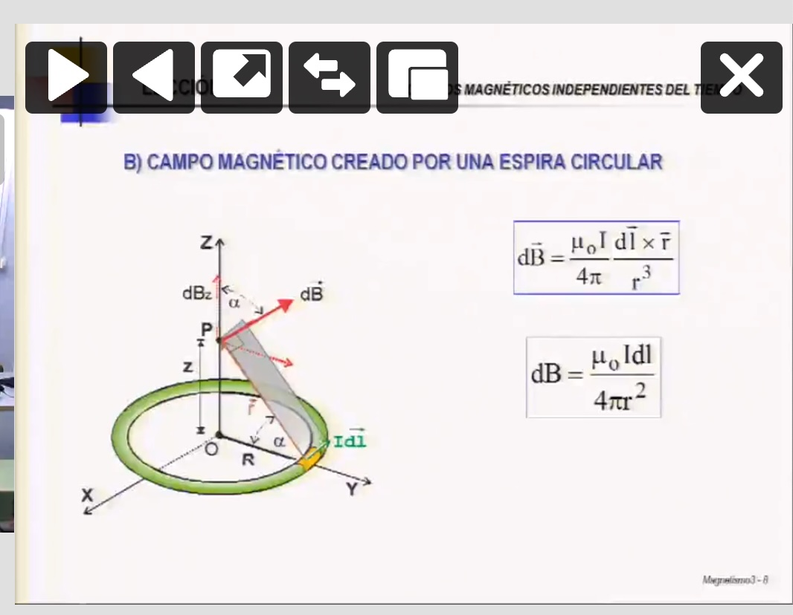

# Vide frame thumbnails

The video manifest file supports video thumbnails, which `paella-core` can use to preview them on the timeline. Besides that there are plugins that allow you to use those thumbnails for more things. In this tutorial we are going to learn how to do all this.

## Video manifest

The `frameList` attribute of the video manifest is an array that allows us to define preview images for each frame we want:

**Video manifest**

```json
{
    ...
    "frameList": {
        "targetContent": "presentation",
        "frames": [
            {
                "id": "frame_000",
                "mimetype": "image/jpeg",
                "time": 0,
                "url": "image_url.jpg",
                "thumb": "thumb_url.jpg"
            },
            ...
        ]
    }
}
```

The `frameList` object contains two attributes:

- **`targetContent`:** Its value has to correspond to the stream content identifier of the video stream from which the frames are extracted. In the example above, `targetContent` is `presentation` because the slides are extracted from the presentation video, and its `content` attribute is `presentation`:

```json
{
    ...
    "streams": [
        ...
        {
            "sources": {
                "mp4": [
                    {
                        "src": "https://repository.paellaplayer.upv.es/belmar-multiresolution/media/720-presentation.mp4",
                        "mimetype": "video/mp4"
                    }
                ]
            },
            "content": "presentation" <<< This is the stream content identifier
        }
    ],
    ...
}
```

- **`frames`:** It is an array of objects that contains the information of the frames extracted from the video indicated by the `targetContent` attribute. Each of the objects representing the frames has the following attributes:
    * **`id`:** is the identifier of the frame. It can be any text string as long as it is unique.
    * **`mimetype`:** is the mimetype of the image of the url attribute. The thumbnail image can be in any other format.
    * **`time`**: is the time instant corresponding to the frame, expressed in seconds.
    * **`url`:** is the URL of the frame image. This image must be at the highest resolution possible, as paella-core will only attempt to load it when it needs to be displayed at full size.
    * **`thumb`**: is the URL of the thumbnail image.

Modify the public/repo/dual-stream/data.json file to add the thumbnail data:

**public/repo/dual-stream/data.json**

```json
{
    ...
    "frameList": {
        "targetContent": "presentation",
        "frames": [
            {
                "id": "frame_854",
                "mimetype": "image/jpeg",
                "time": 854,
                "url": "https://repository.paellaplayer.upv.es/belmar-multiresolution/slides/3d90109c-9608-44c1-8660-fce3f216d716/presentation_cut.jpg",
                "thumb": "https://repository.paellaplayer.upv.es/belmar-multiresolution/slides/403de1df-aa66-44c0-b600-7683acf249b8/presentation_cut.jpg"
            },
            {
                "id": "frame_751",
                "mimetype": "image/jpeg",
                "time": 751,
                "url": "https://repository.paellaplayer.upv.es/belmar-multiresolution/slides/598bd2ba-4fef-4886-884e-0ab82176f13d/presentation_cut.jpg",
                "thumb": "https://repository.paellaplayer.upv.es/belmar-multiresolution/slides/73a6564c-b2d6-4896-b0f1-38129dde2c85/presentation_cut.jpg"
            },
            {
                "id": "frame_0",
                "mimetype": "image/jpeg",
                "time": 0,
                "url": "https://repository.paellaplayer.upv.es/belmar-multiresolution/slides/7dc22bee-14f3-442c-8f0d-30d8b68c8604/presentation_cut.jpg",
                "thumb": "https://repository.paellaplayer.upv.es/belmar-multiresolution/slides/46561b90-85b3-4ad7-a986-cdd9b52ae02b/presentation_cut.jpg"
            },
            {
                "id": "frame_363",
                "mimetype": "image/jpeg",
                "time": 363,
                "url": "https://repository.paellaplayer.upv.es/belmar-multiresolution/slides/d3194d9b-8f65-403b-a639-9de4311a283b/presentation_cut.jpg",
                "thumb": "https://repository.paellaplayer.upv.es/belmar-multiresolution/slides/4505b6d9-8a0c-4809-ade3-840e743188ed/presentation_cut.jpg"
            }
        ]
    }
}
```

If a video manifest contains a list of frames, then `paella-core` will use it to represent them on the timeline when hovering the mouse cursor over them. The video fragments that correspond to each frame will also be displayed on the timeline.


## Slide plugins

Install the `@asicupv/paella-slide-plugins` package in your player project:

```sh
$ npm install @asicupv/paella-slide-plugins
```

Next, import the all the plugins defined in this package. Don`t forget to import the style sheet:

**main.js**

```js
...
import {
    slidePlugins
} from '@asicupv/paella-slide-plugins';

import "@asicupv/paella-core/paella-core.css";
import "@asicupv/paella-basic-plugins/paella-basic-plugins.css";
import "@asicupv/paella-slide-plugins/paella-slide-plugins.css";

const initParams = {
    ...
    plugins: [
        ...basicPlugins,
        ...slidePlugins
    ]
};
...
```

Now we are going to activate some plugins from the package we just added.

## frameControlButtonPlugin

It is a button type plugin, which when activated displays a scrollable view with the frame thumbnails of the video. Hovering the mouse over the thumbnails displays the corresponding image in full resolution (indicated by the url attribute within each frame in the video manifest). Clicking on the thumbnail seeks the video to the instant of time at which that frame appears.

In the configuration file, add the following settings:

**public/settings/settings.json**

```json
{
    ...
    "plugins": {
        ...
        "es.upv.paella.frameControlButtonPlugin": {
            "enabled": true,
            "side": "right",
            "order": 2
        }
    }
}
```

When the image of the frame is displayed in full resolution, it will be displayed over the container of the video stream that corresponds to the `targetContent` attribute in the video manifest.


## nextSlideNavigatorButton and prevSlideNavigatorButton

These are two plugins that are used to move to the previous slide and to the next one. They are plugins of type CanvasButtonPlugin, which are placed in one of the video canvas. These buttons are added in the video canvas and the position indicated in the configuration.

**public/settings/settings.json**

```json
{
    ...
    "plugins": {
        ...
        "es.upv.paella.nextSlideNavigatorButton": {
            "enabled": true,
            "content": [
                "presentation"
            ],
            "side": "right",
            "order": 0
        },

        "es.upv.paella.prevSlideNavigatorButton": {
            "enabled": true,
            "content": [
                "presentation"
            ],
            "side": "right",
            "order": 1
        }
    }
}
```


- **`content`:** is an array where we indicate the content of the video stream where we want to add the buttons. You can add more than one content if you want the buttons to appear in more than one stream.
- **`side`:** indicates the side of the container where we want to add the buttons. When modifying this attribute, we may also need to change the order attribute. Notice how depending on the value of side, it may be necessary to modify the order in which each plugin is loaded:

```json
"es.upv.paella.nextSlideNavigatorButton": {
    ...
    "side": "center",
    "order": 1
},

"es.upv.paella.prevSlideNavigatorButton": {
    ...
    "side": "center",
    "order": 0
}
```


```json
"es.upv.paella.nextSlideNavigatorButton": {
    ...
    "side": "right",
    "order": 0
},

"es.upv.paella.prevSlideNavigatorButton": {
    ...
    "side": "right",
    "order": 1
}
```


If the order attribute of the plugins is not properly configured, the arrows will appear inverted:

```json
"es.upv.paella.nextSlideNavigatorButton": {
    ...
    "side": "left",
    "order": 0
},

"es.upv.paella.prevSlideNavigatorButton": {
    ...
    "side": "left",
    "order": 1
}
```



